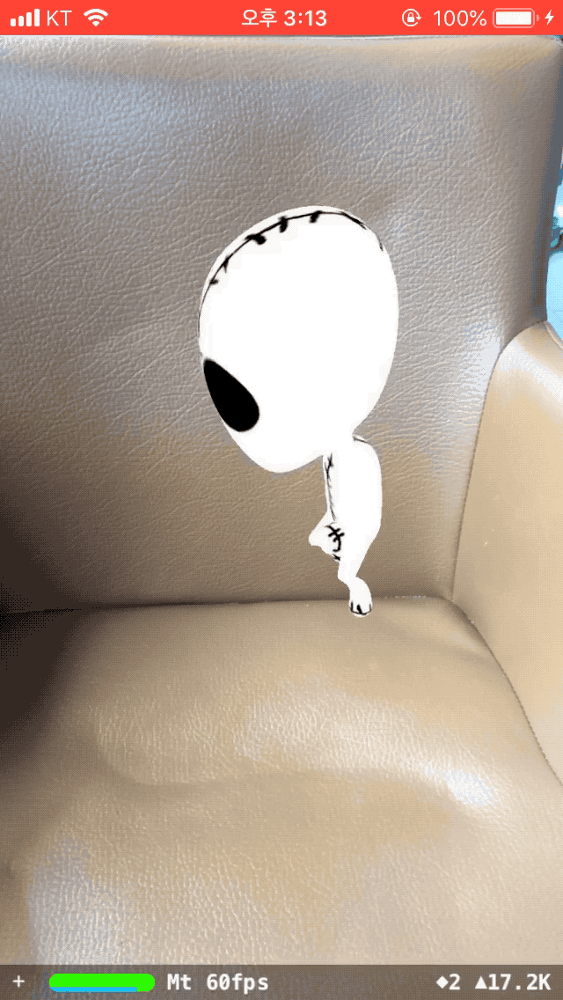

# TheEars

토끼 귀를 이용한 청기백기 게임

> 개발 예정 사항

- ~~애니메이션 사용 가능 여부 확인~~
- 실시간 사용자 얼굴 인식
- 토끼 귀 모델링
- 머리 위에 토끼 귀 붙여주기(애니메이션 가능)
- 각 버튼 누르면 각 토끼 귀 움직이기
- 청기백기 게임 랜덤으로 보여줄 문장 저장
- 게임 성공 실패 확인(타이머 기능 고민중)

## step1

> 개발 - 애니메이션 사용 가능 여부 확인

- <a href="https://www.youtube.com/watch?v=F1FyO0L6Q2Y">How To make 3D model Animation with ARKit</a> 참고
- ARKit 프로젝트 생성
- animation 가능한 dae file 생성을 위해 <a href="https://free3d.com/">free3D Model</a>과 <a href="https://www.mixamo.com/#/">Mixamo</a> 사용
- iOS에서 3D Model Animation 가능하겠다는 결론.

	

## step2

> 토끼 귀 모델링

- 토끼 귀 모양 모델링과 애니메이션 적용

	
- 텍스쳐 설정 및 애니메이션 curve 수정예정